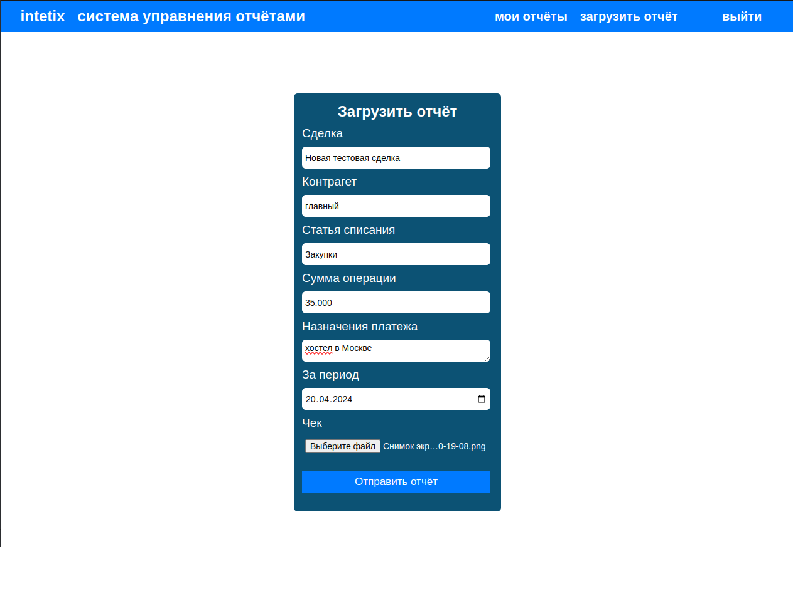
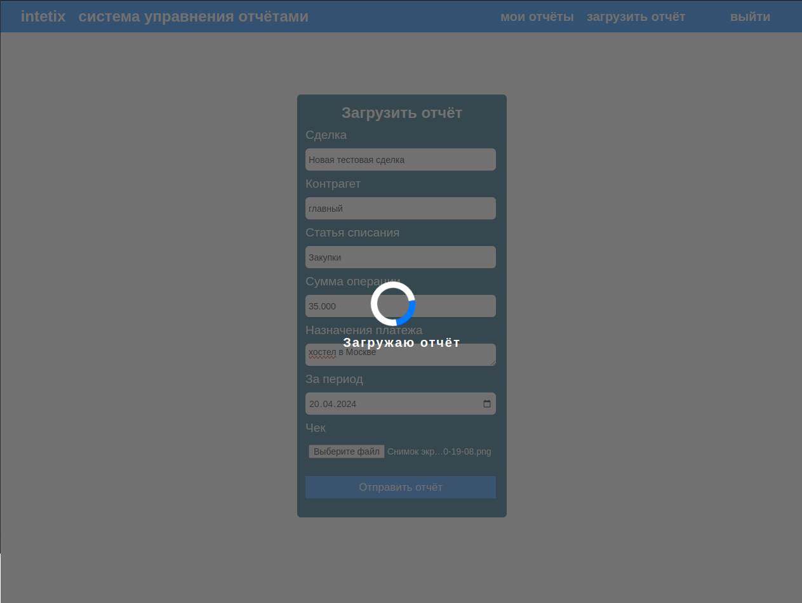
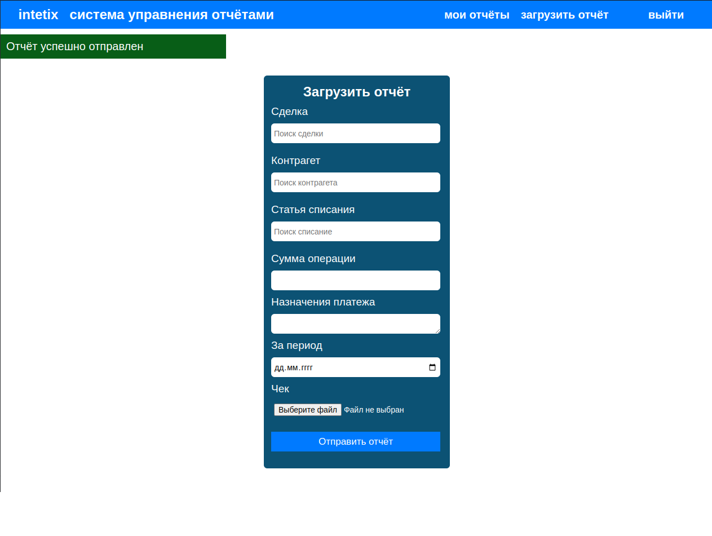
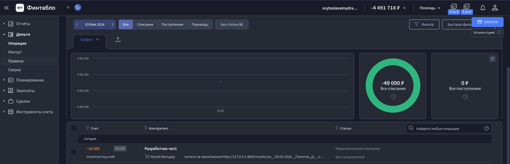
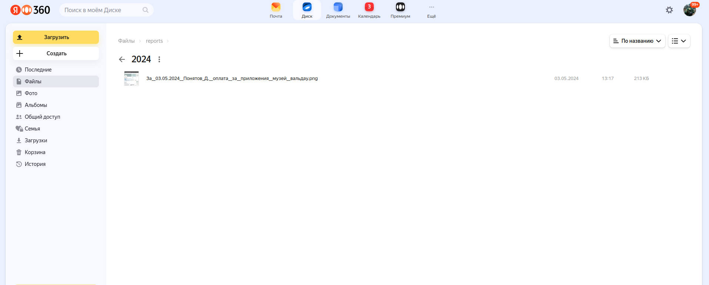

# Django_CRM_Financial_statements

Приложение разработано для удобной загрузки отчетов в бизнес-консалтинговую 
платформу "Фин-табло". Теперь можно быстро загружать отчеты и 
автоматически отправлять их в раздел операций ДДС.

<h3>Функционал</h3>

На главной странице предоставлен удобный поиск с выпадающем списком, 
в котором содержатся данные из "Финтабло". Четыре последних поля 
обязательны для заполнения. Достаточно выбрать необходимые данные, 
прикрепить изображения и отправить форму.

Далее на портале "Финтабло" можно просмотреть загруженный отчёт о списание средствах
и ссылку на изображения в базе данных. 

Также изображение чека дублируется на Яндекс.Диск. В названии содержится дата, 
инициалы, а также информация о цели составления отчёта.

