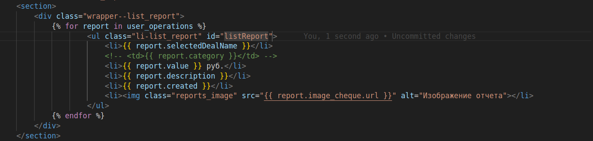
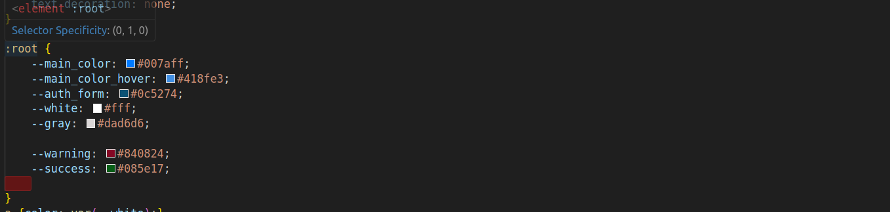
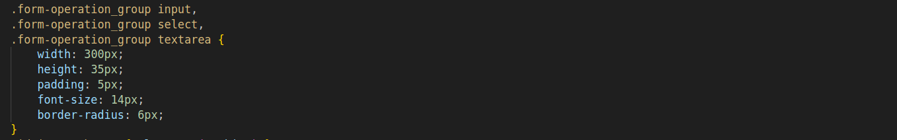
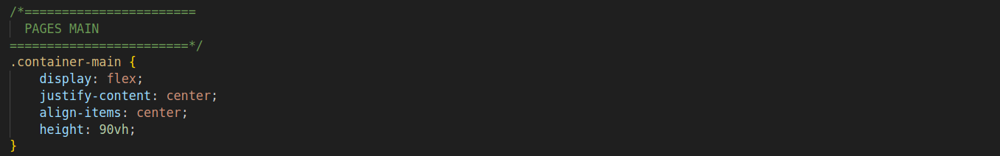
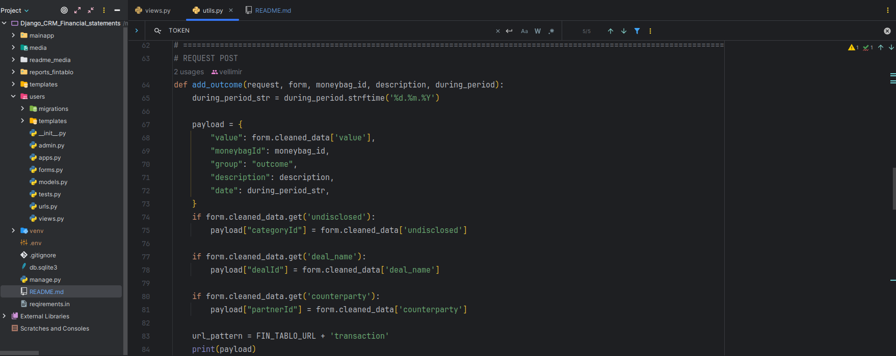
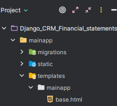
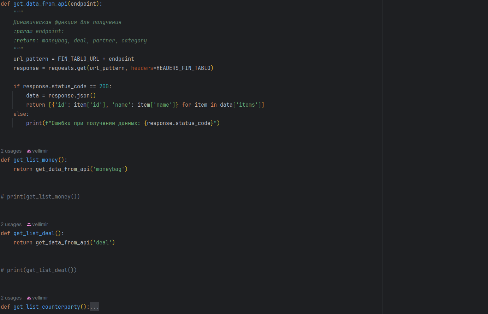

# Django_CRM_Financial_statements

Приложение разработано для удобной загрузки отчетов в бизнес-консалтинговую 
платформу "Фин-табло". Теперь можно быстро загружать отчеты и 
автоматически отправлять их в раздел операций ДДС.

<h3>Функционал</h3>

На главной странице предоставлен удобный поиск с выпадающем списком, 
в котором содержатся данные из "Финтабло". Четыре последних поля 
обязательны для заполнения. Достаточно выбрать необходимые данные, 
прикрепить изображения и отправить форму.

Далее на портале "Финтабло" можно просмотреть загруженный отчёт о списание средствах
и ссылку на изображения в базе данных. 

Также изображение чека дублируется на Яндекс.Диск. В названии содержится дата, 
инициалы, а также информация о цели составления отчёта.

<h3>Для разработки</h3>

#### Важно ! добавить файл .env с секретными ключами и токенами

#### Установить виртуальное окружения:
for Linux/Mac:

    python3 -m venv venv

for Windows

    venv\Scripts\activate

#### Активировать:
for Linux/Mac:

    source venv/bin/activate

for Windows:

    venv\Scripts\activate

#### Установить зависимости:
      pip3 install -r requirements.in

#### Локальный запуск
      python3 manage.py runserver

<h3>Немного простых и важных правил по написанию кода для проекта</h3> 

### Html

Название классов должно построено следующим образом:  
Родительский контейнер class=wrapper--name; 
Дочерний контейнер class=ul--li-list_name; 
Собержимое называть понятным именем name_image, name_title и.т.д; 
Для JavaScript обращение желательно по id; 
При возможности называть классы одинаково в разных блоках, чтобы избежать написания лишней разметки и стилей; 

### Css

Параметры как цвета и шрифты выносить в переменные 

Выносить повторяющиеся параметры стилей в группу 

Строго обозначить в комментариях откуда начинаются параметры для блоков html 

### Python

Весь функционал должен храниться в файле utils.py, в views.py только
обращения в БД согласно документации фреймворка Django. 
utils.py

views.py

Структура страниц html и статических файлов и папок, должна быть построена строго согласно документации фреймворка Django 
mainapp/templates/mainapp/index.html 
 
Секретные ключи, пароли и токены хранить в файле .env, подключение осуществляется через 
константы и библиотеку python-dotenv  
Строго избегать дублирующийся код 
  
При выполнение задачи обязательно создать новую ветку на GitHub/GitLab !

